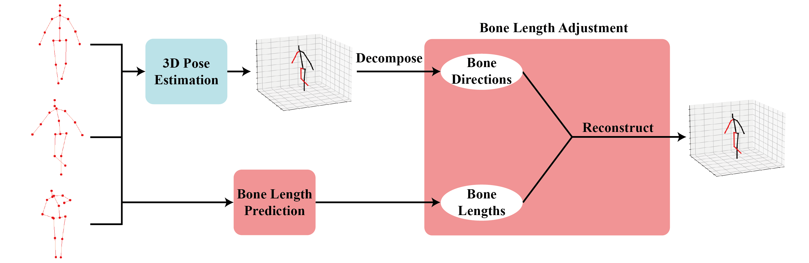

# BLAPose: Enhancing 3D Human Pose Estimation with Bone Length Adjustment

This is the official implementation of the ACCV 2024 paper: [Enhancing 3D Human Pose Estimation with Bone Length Adjustment](https://arxiv.org/abs/2410.20731)

<p align="center">  </p>

## Environment

The models are trained and tested under the following environment:

- Python 3.9.7
- PyTorch 
- CUDA

For more detailed dependencies, please refer to `requirements.txt`.

## Quick start

You may quickly download all preprocessed data by the following command:

```
python setup.py 
```

Note that `gdown==v4.6.3` is required and the Human3.6M dataset is NOT available. To download the Human3.6M dataset, please refer to [DATASETS.md](https://github.com/facebookresearch/VideoPose3D/blob/main/DATASETS.md).

## Dataset

### Human3.6M

The Human3.6M dataset setup follows the instructions provided by [VideoPose3D](https://github.com/facebookresearch/VideoPose3D). Detailed setup steps can be found in their [DATASETS.md](https://github.com/facebookresearch/VideoPose3D/blob/main/DATASETS.md). 
Additionally, video sources for Human3.6M are accessible from [Human3.6M](http://vision.imar.ro/human3.6m/description.php).


### Synthetic Bone Length

Generating synthetic bone lengths involves using [SMPL](https://smpl.is.tue.mpg.de/index.html) and [Pose2Mesh](https://github.com/hongsukchoi/Pose2Mesh_RELEASE).

- SMPL: Download version 1.1.0 for Python 2.7 from [SMPL](https://smpl.is.tue.mpg.de/index.html). Rename the files as follows:
    - `basicmodel_f_lbs_10_207_0_v1.1.0.pkl` to `SMPL_FEMALE.pkl`
    - `basicmodel_m_lbs_10_207_0_v1.1.0.pkl` to `SMPL_MALE.pkl`
    - `basicmodel_neutral_lbs_10_207_0_v1.1.0.pk` to `SMPL_NEUTRAL.pkl`
- `J_regressor_h36m_correct.npy`: Download this file from [Pose2Mesh](https://github.com/hongsukchoi/Pose2Mesh_RELEASE/blob/master/data/Human36M/J_regressor_h36m_correct.npy)

Ensure your directory structure matches the following hierarchy:
```
BLAPose 
└─ data 
   ├─ data_2d_h36m_cpn_ft_h36m_dbb.npz 
   ├─ data_2d_h36m_gt.npz 
   ├─ data_3d_h36m.npz 
   └─ bone_length 
      ├─ J_regressor_h36m_correct.npy 
      └─ body_models 
         └─ smpl 
            ├─ SMPL_FEMALE.pkl 
            ├─ SMPL_MALE.pkl 
            └─ SMPL_NEUTRAL.pkl 
```

The SMPL environment requires slightly different dependencies. It's recommended to create a new virtual environment for generating synthetic bone lengths. Details are available in `data/bone_length/requirements.txt`. Required packages include:

- numpy<=1.23.1
- smplx==0.1.28


Generate synthetic bone lengths by running the following command:

```
cd data/bone_length/ 
python generate_bone_length.py --gender neutral --amount 200000 --align 
```

Or you may download the preprocessed data from [Google Drive](https://drive.google.com/drive/folders/10CLfvL5izh-V_IXPlbVYhDSwklXuMkQh?usp=drive_link) and put them in `data/`.

## Training from Scratch

### Bone Length Model

To reproduce our Bi-GRU model or GRU model as described in the paper, execute:

```
# bi-GRU model
python train.py -e 30 -b 256 -t length -drop 0 --length_aug_type smpl -bi \
    --bone_length_aug data/bone_lengths_smpl_neutral_all.npz 
# bi-GRU model without using test set mean values 
python train.py -e 30 -b 256 -t length -drop 0 --length_aug_type smpl -bi \
    --bone_length_aug data/bone_lengths_smpl_neutral_train.npz 
# GRU model 
python train.py -e 30 -b 256 -t length -drop 0 --length_aug_type smpl --seed 9487 \
    --bone_length_aug data/bone_lengths_smpl_neutral_all.npz 
```

### Fine-tuning

We fine-tuned the [VideoPose3D](https://github.com/facebookresearch/VideoPose3D) model. Download the pretrained model `pretrained_h36m_cpn.bin` from their repository and place it in the `checkpoint/` directory (create the directory if it doesn't exist).

Since we fixed the parameters in the length model, we may predict all bone lengths before the fine-tuning. The following command is for bone length prediction with the bi-GRU model:

```
python length_model_inference.py --ckpt biGRU_all.bin -bi \
    --subjects S1,S5,S6,S7,S8,S9,S11
```

This will generate `lengths_dict.npz` and `lengths_list.npz` in the `data/` directory. To reproduce our fine-tuning results, use:

```
python train.py -e 40 -b 1024 -lr 4e-5 -arc 3,3,3,3,3 -t mix -bi \
    --length_model biGRU_all.bin \
    --direction_model pretrained_h36m_cpn.bin \
    --bone_length_list data/lengths_list.npz
```

## Evaluation

Pretrained models can be downloaded from [Google Drive](https://drive.google.com/drive/folders/1dwCqZs8HCqlijyHXD0KYOnKqGsGuoi8E?usp=drive_link). The `biGRU_all.bin` uses the synthetic bone lengths aligned with mean values of the entire dataset. The `biGRU_train.bin` uses the synthetic bone lengths aligned with mean values of training set only.

### Adjustment

To adjust poses predicted by existing models, first obtain `lengths_dict.npz` and `lengths_list.npz` using:

```
python length_model_inference.py --ckpt biGRU_all.bin -bi --subjects S9,S11
```

Then we adjust the poses predicted by existing lifting models. The results of these lifting models can be obtained by following the instructions in their repo. Alternatively, our preprocessed results are available on [Google Drive](https://drive.google.com/drive/folders/16N9hnOAkmmnfZGix_kTFKyjoQbfYBF4v?usp=drive_link), containing the results of the following lifting models:

- Anatomy3D: [Repo](https://github.com/sunnychencool/Anatomy3D) 
- D3DP: [Repo](https://github.com/paTRICK-swk/D3DP) 
- DiffPose: [Repo](https://github.com/GONGJIA0208/Diffpose) 
- FinePose: [Repo](https://github.com/PKU-ICST-MIPL/FinePOSE_CVPR2024)
- KTPFormer: [Repo](https://github.com/JihuaPeng/KTPFormer)
- MHFormer: [Repo](https://github.com/Vegetebird/MHFormer) 
- MixSTE: [Repo](https://github.com/JinluZhang1126/MixSTE) 
- PoseFormer: [Repo](https://github.com/zczcwh/PoseFormer) 
- PoseFormerV2: [Repo](https://github.com/QitaoZhao/PoseFormerV2)
- STCFormer: [Repo](https://github.com/zhenhuat/STCFormer)
- VideoPose3D: [Repo](https://github.com/facebookresearch/VideoPose3D) 


Ensure your directory structure follows:

```
BLAPose 
└─ 3D_prediction 
   ├─ Anatomy3D 
   │  ├─ prediction.pkl 
   │  └─ action_dict.pkl 
   ├─ D3DP 
   │  ├─ prediction.pkl 
   │  └─ action_dict.pkl 
   │ 
   ... 
   │ 
   ├─ STCFormer 
   │  ├─ prediction.pkl 
   │  └─ action_dict.pkl 
   └─ VideoPose3D 
      ├─ prediction.pkl 
      └─ action_dict.pkl 
```

For example, you can evaluate the adjustment on Anatomy3D by the following command:

```
python bone_adjust.py --act 3D_prediction/Anatomy3D/action_dict.pkl \
    --pred 3D_prediction/Anatomy3D/prediction.pkl \
    --bone data/lengths_dict.npz
```

### Fine-tuned model

You may evaluate the fine-tuned model using:

```
python train.py -arc 3,3,3,3,3 -t mix -bi --mix_model videopose_finetuned.bin --evaluate
```


## Visualization (Inference in the wild)

Our method relies on 2D-to-3D lifting models. Therefore, we provide two visualization approaches:
- Visualizing the adjusted 3D poses based on the predicted 3D poses
- Predicting 3D poses from video using our fine-tuned model, followed by visualizing the result

### Predicted 3D poses

First, you should predict 3D poses with any other 2D-to-3D lifting models and save it with shape (number of frames, 17, 3) in Human 3.6M format. Then you may visualize the adjusted result by the following command:

```
python inference.py --length_ckpt biGRU_all.bin -bi --video path/to/in_the_wild_video.mp4 --poses path/to/predicted_poses.npz
```

### Fine-tuned model

Our fine-tuned model integrates the [VideoPose3D](https://github.com/facebookresearch/VideoPose3D) model and our adjustment process. you can visualize the result by the following command:

```
python inference.py --finetuned_ckpt videopose_finetuned.bin -bi --video path/to/in_the_wild_video.mp4
```

<p align="center">  </p>

## Acknowledgement

Our work builds on [VideoPose3D](https://github.com/facebookresearch/VideoPose3D). We sincerely appreciate the authors for their invaluable codes release.
